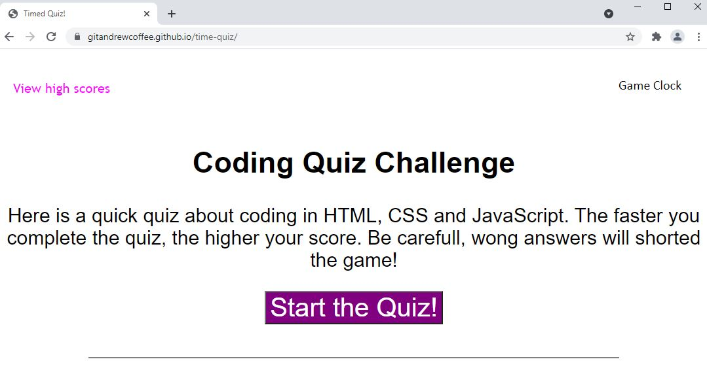

# Time Quiz

## Purpose
Module 4, Challenge 4 for University of Minnesota Coding Booking, Fall 2021  

Write a new web application from scratch that gives the user a timed quiz.  

### User Story:

AS A coding boot camp student  
I WANT to take a timed quiz on JavaScript fundamentals that stores high scores  
SO THAT I can gauge my progress compared to my peers  

### Acceptence Criteria
GIVEN I am taking a code quiz  
WHEN I click the start button  
THEN a timer starts and I am presented with a question  
WHEN I answer a question  
THEN I am presented with another question  
WHEN I answer a question incorrectly  
THEN time is subtracted from the clock  
WHEN all questions are answered or the timer reaches 0  
THEN the game is over  
WHEN the game is over  
THEN I can save my initials and score  

## Example Site Rendering

## Built With
* HTML
* CSS
* JavaScript

## Website
https://gitandrewcoffee.github.io/time-quiz/

## Contribution
Made with ❤️ by GitAndrewCoffee
